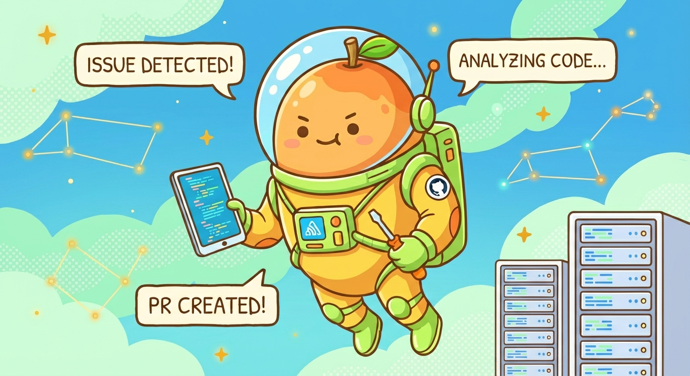
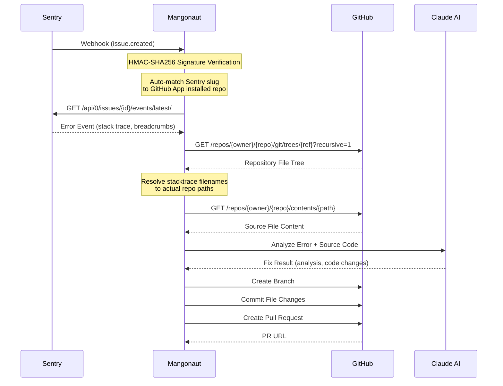

# Mangonaut

<p align="center">An open-source service that analyzes Sentry error alerts with AI and automatically creates fix Pull Requests</p>

    

Mangonaut detects production errors in real-time, automatically analyzes them with AI, and creates fix Pull Requests.
When a Sentry Webhook is received, it extracts the error's stack trace and related source code, sends them to an LLM (Claude) for analysis, and automatically creates a PR with code fixes on GitHub.

## How It Works



## Features

- **Sentry Webhook Integration** - Receives errors instantly via Webhook with HMAC-SHA256 signature verification for security
- **AI-Powered Error Analysis** - Leverages Claude API to analyze root causes and generate code fix suggestions
- **Automated PR Creation** - Creates fix branches and Pull Requests on GitHub based on analysis results
- **Dynamic Project Mapping** - Automatically maps Sentry project slugs to GitHub repositories via GitHub App installation, with no manual configuration needed
- **Language-Agnostic File Resolution** - Dynamically resolves stacktrace filenames to actual repository paths using the Git Tree API, supporting any language or project structure
- **Confidence-Based Filtering** - Controls automatic PR creation based on LLM analysis confidence level (HIGH/MEDIUM/LOW)
- **Async Processing** - Returns 200 OK immediately upon Webhook receipt, then processes analysis and PR creation asynchronously
- **DDD Layered Architecture** - Clean separation of Domain, Application, Presentation, and Infrastructure layers

## Architecture

```
mangonaut/
├── subproject/
│   ├── boot/              # Spring Boot Entry Point
│   ├── domain/            # Domain Models, Port Interfaces (no framework dependencies)
│   ├── application/       # Use Cases (business orchestration)
│   ├── presentation/      # REST Controllers, DTOs, Webhook Handling
│   └── infrastructure/    # Adapter Implementations (Sentry, GitHub, Claude)
```

| Layer | Role | Key Components |
|-------|------|----------------|
| **Domain** | Domain models, port definitions | `ErrorEvent`, `FixResult`, `ErrorSourcePort`, `ScmProviderPort`, `LlmProviderPort` |
| **Application** | Use case orchestration | `ProcessErrorAlertUseCase`, `AnalyzeErrorUseCase`, `CreateFixPullRequestUseCase` |
| **Presentation** | HTTP request/response handling | `SentryWebhookController`, `GlobalExceptionHandler`, `WebhookVerificationService` |
| **Infrastructure** | External system integration | `SentryErrorSourceAdapter`, `GitHubScmAdapter`, `ClaudeLlmAdapter`, `GitHubInstallationRepositoryClient` |

## Getting Started

### Prerequisites

- **Java 25+**
- **Gradle 8.x+**
- **Sentry** - A Sentry organization with an Internal Integration configured
- **GitHub App** - A GitHub App installed on the target repositories
- **Anthropic API Key** - API key for Claude API access

### Installation

```bash
git clone git@github.com:Sujin1135/mangonaut.git
cd mangonaut
./gradlew build
```

### Run

```bash
./gradlew :subproject:boot:bootRun
```

The server runs at `http://localhost:8080` by default.

## Configuration

### Environment Variables

| Variable | Required | Description | Example |
|----------|----------|-------------|---------|
| `MANGONAUT_SENTRY_ORG` | Yes | Sentry Organization Slug | `my-org` |
| `MANGONAUT_SENTRY_TOKEN` | Yes | Sentry Internal Integration Token | `30936...` |
| `MANGONAUT_WEBHOOK_SECRET` | Yes | Client Secret for Sentry Webhook signature verification | `abcdef123456...` |
| `MANGONAUT_GITHUB_APP_ID` | Yes | GitHub App ID | `123456` |
| `MANGONAUT_GITHUB_INSTALLATION_ID` | Yes | GitHub App Installation ID | `78901234` |
| `MANGONAUT_GITHUB_PRIVATE_KEY` | Yes | GitHub App Private Key (Base64-encoded PEM) | `LS0tLS1CRUdJ...` |
| `MANGONAUT_LLM_API_KEY` | Yes | Anthropic API Key | `sk-ant-...` |

### application.yml

```yaml
mangonaut:
  # Sentry Integration
  sentry:
    base-url: https://us.sentry.io        # Change based on your Sentry region
    org: ${MANGONAUT_SENTRY_ORG:}
    token: ${MANGONAUT_SENTRY_TOKEN:}
    webhook-secret: ${MANGONAUT_WEBHOOK_SECRET:}

  # GitHub App Integration
  github:
    base-url: https://api.github.com
    app-id: ${MANGONAUT_GITHUB_APP_ID:}
    installation-id: ${MANGONAUT_GITHUB_INSTALLATION_ID:}
    private-key: ${MANGONAUT_GITHUB_PRIVATE_KEY:}

  # LLM Configuration
  llm:
    provider: claude
    model: claude-sonnet-4-20250514
    api-key: ${MANGONAUT_LLM_API_KEY:}
    base-url: https://api.anthropic.com

  # Behavior Configuration
  behavior:
    auto-pr: true                          # Enable automatic PR creation
    min-confidence: MEDIUM                 # Minimum confidence level (LOW, MEDIUM, HIGH)
    labels:                                # Labels to add to PRs
      - auto-fix
      - ai-generated
    branch-prefix: fix/mangonaut-          # Prefix for fix branches
    dry-run: false                         # If true, only analyzes without creating PRs
```

### Project Mapping

Mangonaut **automatically maps Sentry projects to GitHub repositories** by matching the Sentry project slug against the GitHub App's installed repository names. No manual `projects` configuration is needed.

**How it works:**
1. On startup, Mangonaut fetches the list of repositories where the GitHub App is installed
2. This list is refreshed every 5 minutes
3. When a Sentry webhook arrives, the project slug is matched against installed repo names
4. Stacktrace filenames are resolved to actual file paths using the Git Tree API

**Example:** If your Sentry project slug is `my-backend` and the GitHub App is installed on the `my-org/my-backend` repository, the mapping happens automatically.

## External Service Setup

### Sentry

1. **Create an Internal Integration**
   - Sentry > Settings > Developer Settings > **Create New Internal Integration**
   - **Webhook URL**: Your Mangonaut deployment URL + `/webhooks/sentry` (e.g., `https://your-domain.com/webhooks/sentry`)
   - **Webhooks**: Check `issue`
   - **Permissions**: Issue & Event → Read or higher

2. **Set Environment Variables**
   - `MANGONAUT_SENTRY_TOKEN`: The **Token** from the created Internal Integration
   - `MANGONAUT_WEBHOOK_SECRET`: The Internal Integration's **Client Secret** (used for Webhook signature verification)
   - `MANGONAUT_SENTRY_ORG`: Organization Settings > General > **Organization Slug**

3. **Configure Alert Rules**
   - Sentry > Alerts > **Create Alert Rule**
   - Conditions: When a new issue is created
   - Action: **Send a notification via {Your Internal Integration Name}**

> **Sentry Region Note**
> - US Region: `https://us.sentry.io`
> - EU Region: `https://sentry.io`
>
> Set `mangonaut.sentry.base-url` according to your organization's region.

### GitHub App

1. **Create a GitHub App**
   - GitHub > Settings > Developer settings > GitHub Apps > **New GitHub App**
   - **Homepage URL**: Your deployment URL
   - **Webhook**: Uncheck "Active" (Mangonaut doesn't use GitHub webhooks)
   - **Repository permissions**:
     - `Contents`: **Read and Write** (for branch creation and file commits)
     - `Pull requests`: **Read and Write** (for PR creation)
     - `Metadata`: **Read-only** (required for repository listing)

2. **Generate a Private Key**
   - In the App settings page, scroll to **Private keys** > **Generate a private key**
   - Base64-encode the downloaded `.pem` file:
     ```bash
     base64 -i your-app-name.pem | tr -d '\n'
     ```

3. **Install the App**
   - In the App settings page, click **Install App**
   - Select the organization/account and choose the repositories to monitor

4. **Set Environment Variables**
   - `MANGONAUT_GITHUB_APP_ID`: The **App ID** (found in the App settings page)
   - `MANGONAUT_GITHUB_INSTALLATION_ID`: The **Installation ID** (found in the URL after installing: `https://github.com/settings/installations/{id}`)
   - `MANGONAUT_GITHUB_PRIVATE_KEY`: The Base64-encoded private key from step 2

### Anthropic (Claude)

1. Generate an API Key at [Anthropic Console](https://console.anthropic.com)
2. **Set Environment Variable**
   - `MANGONAUT_LLM_API_KEY`: The generated API Key

## Local Development with ngrok

Use [ngrok](https://ngrok.com/) to test Sentry Webhooks in a local environment.

```bash
# 1. Run Mangonaut
./gradlew :subproject:boot:bootRun

# 2. Expose local server via ngrok
ngrok http 8080

# 3. Set the ngrok URL as the Webhook URL in Sentry Internal Integration
#    e.g., https://xxxx-xxx.ngrok-free.app/webhooks/sentry
```

## API Endpoints

| Method | Path | Description |
|--------|------|-------------|
| `POST` | `/webhooks/sentry` | Sentry Webhook receiver endpoint |
| `GET` | `/actuator/health` | Health check (includes Sentry, GitHub, Claude connectivity status) |

## Tech Stack

| Category | Technology |
|----------|-----------|
| Language | Kotlin 2.3.10 |
| Framework | Spring Boot 4.0.2, Spring WebFlux |
| Async | Kotlin Coroutines, Reactor |
| Build | Gradle Kotlin DSL |
| LLM | Claude API (Anthropic) |
| Error Source | Sentry API |
| SCM | GitHub API (GitHub App) |
| Test | Kotest 6.0.0.M2, MockK 1.14.2 |

## License

MIT License
